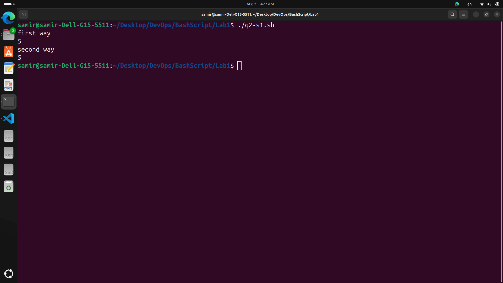
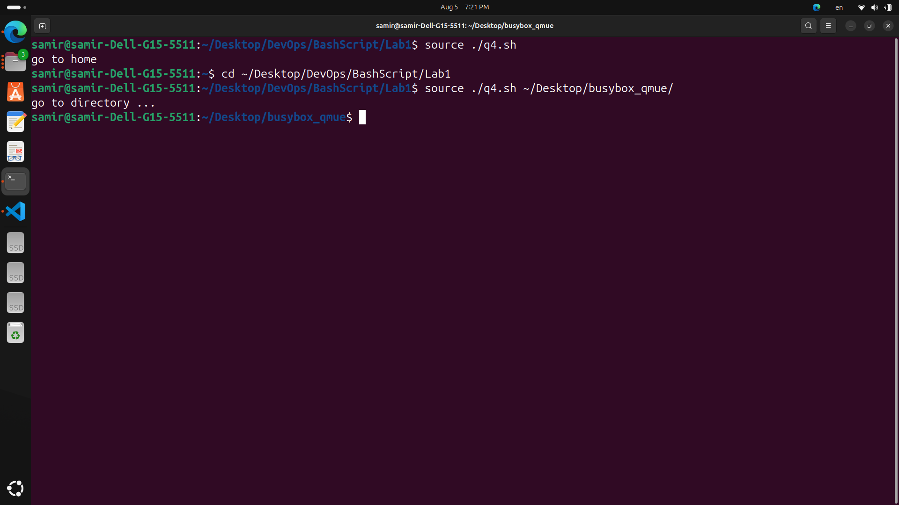

# LAB 1
***Create a script that asks for user name then send a greeting to him***
```
#!/bin/bash 
read -p "please enter your name" name
echo "Hello ${name}"
```


***Create a script called s1 that calls another script s2 where:***
- In s1 there is a variable called x, it's value 5 
- Try to print the value of x in s2 by two different ways. 
```
in s1 script
#!/bin/bash 
export x=5
echo "first way"
./q2-s2.sh
unset x
x=5
echo "second way"
./q2-s3.sh $x

in s2 script
echo ${x}

in s3 script
echo ${x}
```


***Create a script called mycp where:*** 
- It copies a file to another 
- It copies multiple files to a directory. 
```
#!/bin/bash 

if [ $# -eq 2 ]
then

    if [ -e $1 -a -e $2 ]
    then
        cat $1 > $2
        echo "copy is done"
    fi

elif [ $# -gt 2 ]
then 
    if [ -d "${!#}" ]
    then
        xar=1

        for var in "${@:1:$#-1}";do
            if [ -e "$var" ]
            then
                echo "$var is exist"
            else
                echo "$var is not exist"
                xar=0
            fi
        done

        if [ $xar -eq 1 ]
        then 
            echo "ready for copy"

            for var in "${@:1:$#-1}";do
                cp  "$var" "${!#}"
            done

            echo "copy is done"

        else
            echo "copy not done"
        fi

    else
        echo "Error: The last argument is not a directory"
    fi
else
    echo "error"
fi

```


***Create a script called mycd where:***
- It changed directory to the user home directory, if it is called without arguments. 
- Otherwise, it change directory to the given directory.
```
#!/bin/bash
if [ $# -eq 1 ]
then 
    echo "go to directory ... "
    cd "${!#}"
elif [ $# -lt 1 ]
then
    echo "go to home"
    cd "$HOME" || echo "Failed to change directory"
else
    echo "too much parameters"
fi
```


***Create a script called myls where:***
- It lists the current directory, if it is called without arguments. 
- Otherwise, it lists the given directory.
```
#!/bin/bash
if [ $# -eq 1 ]
then 
    echo "list directory ... "
    ls "${!#}"
elif [ $# -lt 1 ]
then
    echo "list current directory"
    ls 
else
    echo "too much parameters"
fi
```


***Enhance the above script to support the following options individually:***
- -l: list in long format  
- -a: list all entries including the hiding files.
- -d: if an argument is a directory, list only its name d. 
- -i: print inode number e. 
- -R: recursively list subdirectories 
```
#!/bin/bash

# Initialize options
long_format=""
all_entries=""
dir_only=""
inode=""
recursive=""

# Parse options
while getopts "ladiR" opt; do
  case ${opt} in
    l) long_format="-l" ;;
    a) all_entries="-a" ;;
    d) dir_only="-d" ;;
    i) inode="-i" ;;
    R) recursive="-R" ;;
    \?)
      echo "Invalid option"
      exit 1
      ;;
  esac
done

ls_command="ls $long_format $all_entries $dir_only $inode $recursive"

if [ "$#" -eq 0 ]; then
  $ls_command
else
  for dir in "$@"; do
    $ls_command "$dir"
  done
fi
```


***Bonus: enhance the above script to support the following Synopsis*** 
- myls -option1 -option2 
- myls -option2 -option1 
- myls -optionloption2 
- myls -option2option1
```
#!/bin/bash

# Initialize options
long_format=""
all_entries=""
dir_only=""
inode=""
recursive=""

# Parse options
while getopts "ladiR" opt; do
  case ${opt} in
    l) long_format="-l" ;;
    a) all_entries="-a" ;;
    d) dir_only="-d" ;;
    i) inode="-i" ;;
    R) recursive="-R" ;;
    \?)
      echo "Invalid option"
      exit 1
      ;;
  esac
done

ls_command="ls $long_format $all_entries $dir_only $inode $recursive"

if [ "$#" -eq 0 ]; then
  $ls_command
else
  for dir in "$@"; do
    $ls_command "$dir"
  done
fi
```


***Create a script called mytest where:***
- It check the type of the given argument (file/directory) 
- It check the permissions of the given argument (read/write/execute)
```
#!/bin/bash

if [ $# -eq 1 ]
then 
    if [ -d "${!#}" ]
    then
        echo "this is directory " 
        stat -c "%A" "${!#}"
    elif [ -f "${!#}" ]
    then
        echo "this is file " 
        stat -c "%A" "${!#}"
    else
        echo "Invalid type "
    fi
else
echo "Invalid parameter "
fi
```


***Create a script called myinfo where:*** 
- It asks the user about his/her logname. 
- It print full info about files and directories in his/her home directory 
- Copy his/her files and directories as much as you can in /tmp directory. 
- Gets his current processes status. 
```
#!/bin/bash
read -p "Please enter your logname: " logname

echo "Full info about files and directories in home directory:"
ls -la /home/$logname

echo "Copying files to /tmp directory:"
cp -r /home/$logname/* /tmp/

echo "Current process status:"
ps -u $logname
```

