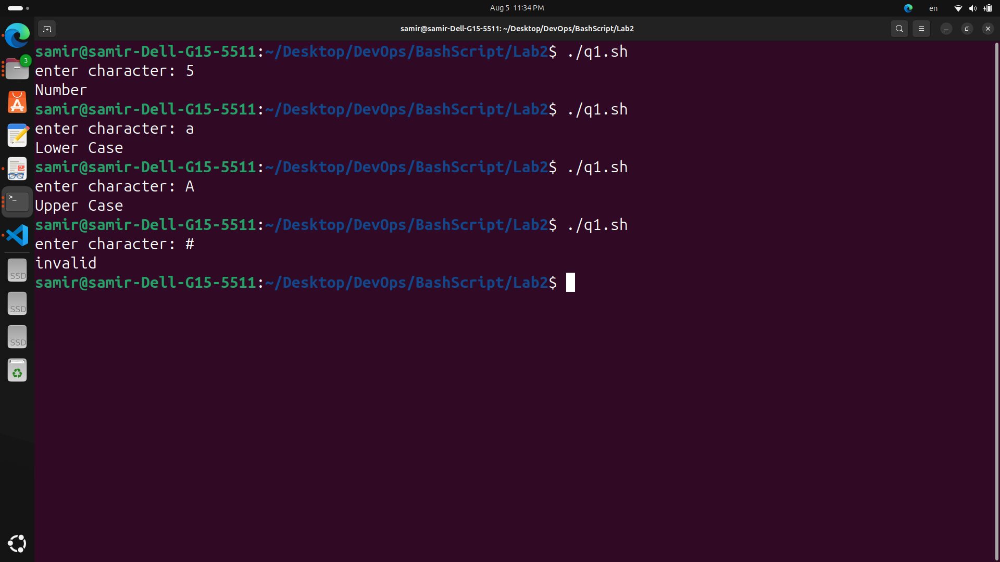
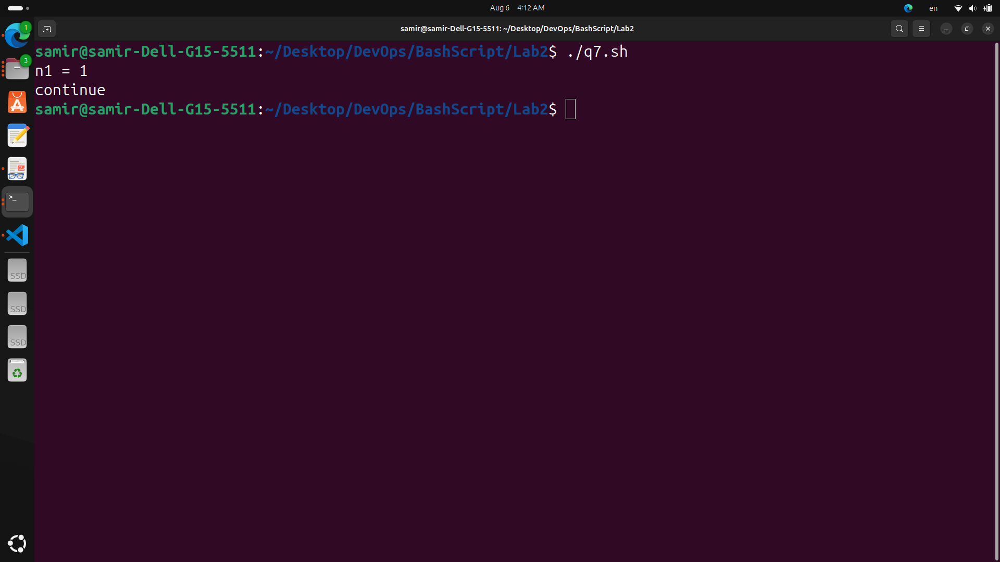
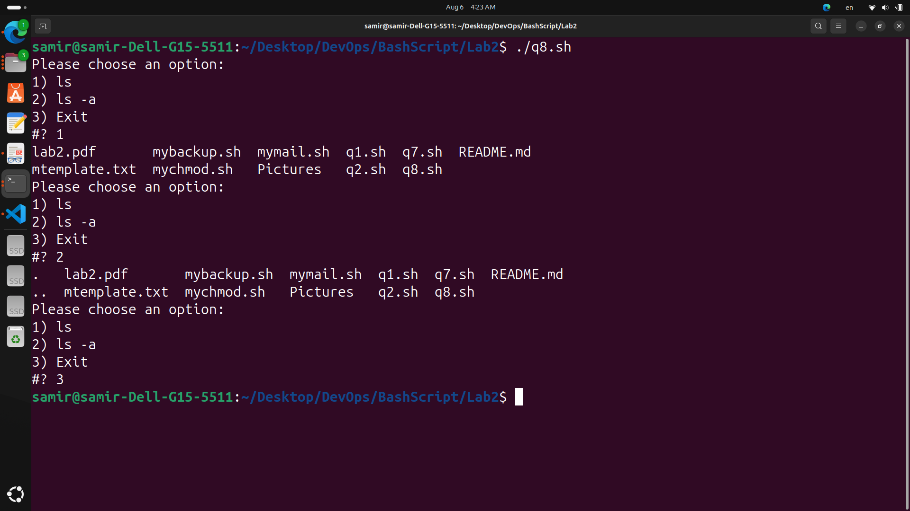
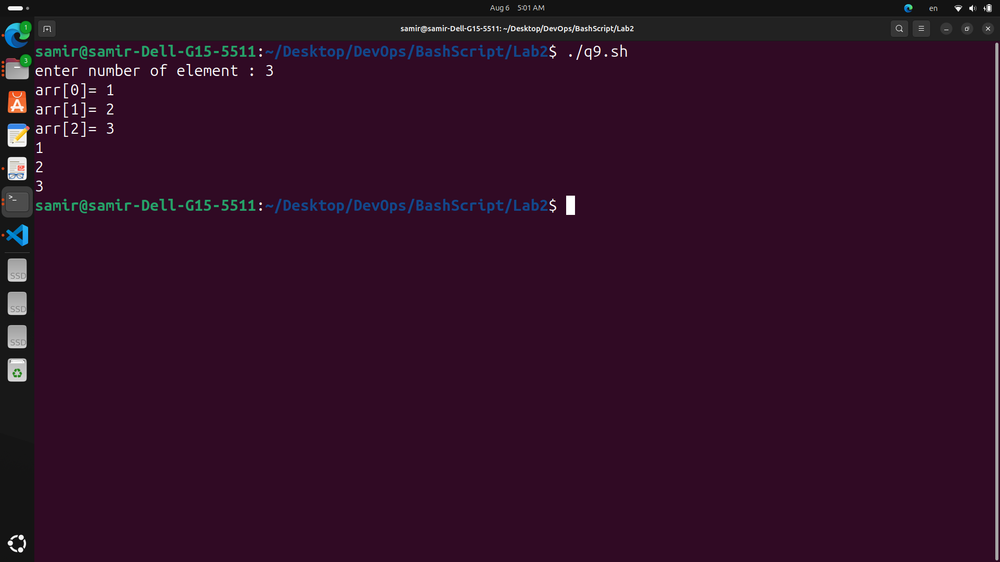
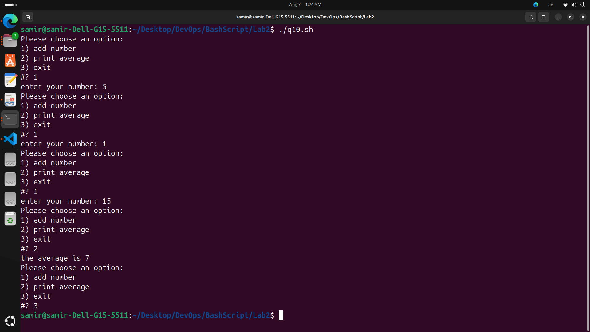
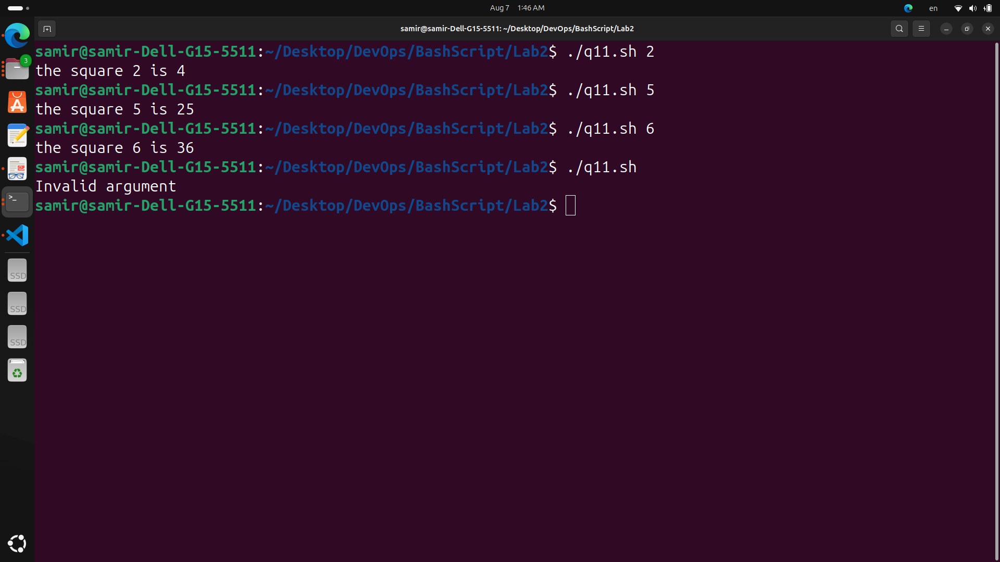

# LAB 2

***Write a script called mycase, using the case utility to checks the type of character entered by a user:***
- Upper Case
- Lower Case
- Number
- Nothing
```
read -p "enter character: " var
case $var in
    [a-z])
        echo "Lower Case"
        ;;
    [A-Z])
        echo "Upper Case"
        ;;
    [1-9])
        echo "Number"
        ;;
    "")
        echo "Nothing"
        ;;
    *)
        echo "invalid"
        ;;
esac
```


***Enhanced the previous script, by checking the type of string entered by a user:***
- Upper Cases
- Lower Cases
- Numbers
- Mix
```
#!/bin/bash
read -p "enter your string: " var
if [[ $var =~ ^[A-Z]+$ ]]; then
    echo "Upper Cases"
elif [[ $var =~ ^[a-z]+$ ]]; then
    echo "Lower Cases"
elif [[ $var =~ ^[0-9]+$ ]]; then
    echo "Numbers"
elif [[ -z $var ]]; then
    echo "Nothing"
else
    echo "Mix"
fi
```
***Write a script called mychmod using for utility to give execute permission to all files and directories in your home directory***
```
#!/bin/bash

for item in "$HOME"/*; do
    chmod +x "$item"
done
```
***Write a script called mybackup using for utility to create a backup of only files in your home directory***
```
#!/bin/bash

backup_dir="$HOME/backup"

# Create the backup directory if it doesn't exist
mkdir -p "$backup_dir"

for file in "$HOME"/*; do
    if [[ -f $file ]]; then
        cp "$file" "$backup_dir"
    fi
done

echo "Backup completed."
```

***Write a script called mymail using for utility to send a mail to all users in the system. Note: write the mail body in a file called mtemplate***
```
#!/bin/bash

mail_body="./mtemplate"

for user in $(cut -d: -f1 /etc/passwd); do
    mail -s "Subject" "$user" < "$mail_body"
done
```

***Write a script called chkmail to check for new mails every 10 seconds. Note: mails are saved in /var/mail/username***
```
#!/bin/bash

while true; do
    for user in $(cut -d: -f1 /etc/passwd); do
        if [[ -s /var/mail/$user ]]; then
            echo "New mail for $user"
        fi
    done
    sleep 10
done
```

***What is the output of the following script***
```
#!/bin/bash
typeset -i n1 
typeset -i n2
n1=1 n2=1 
while test $n1 -eq $n2 
do
n2=$n2+1
echo "n1 = ${n1}"
if [ $n1 -gt $n2 ]
then
    echo "break"
    break
else
    echo "continue"
    continue
fi
n1=$n1+1
"n2 = ${n2}"
echo "n2 = ${n2}"
done

#the Output is 1
```


***Create the following menu:***
- Press 1 to ls
- Press 2 to ls -a
- Press 3 to exit
```
#!/bin/bash
while true; do
    echo "Please choose an option:"
    select option in "ls" "ls -a" "Exit"; do
        case $REPLY in
            1) ls ;;
            2) ls -a ;;
            3) exit 0 ;;
            *) echo "Invalid option. Please try again." ;;
        esac
        break
    done
done

```


***Write a script called myarr that ask a user how many elements he wants to enter in an array, fill the array and then print it***
```
#!/bin/bash
declare -i var
declare -i counter
declare -a myarray
read -p "enter number of element : " var
counter=0

while [ $counter -lt $var ];do

    read -p "arr[${counter}]= " num

    myarray[${counter}]=$num

    counter=$counter+1
done

for xar in "${myarray[@]}"; do
    echo $xar
done
```


***Write a script called myavg that calculate average of all numbers entered by a user***
```
#!/bin/bash

declare -i counter
declare -i zar
declare -i average

declare -a arr
counter=0
average=0

while true;do
    echo "Please choose an option:"
    select xar in "add number" "print average" "exit"; do
        case $REPLY in
            1) read -p "enter your number: " zar
                arr[$counter]=$zar
                counter=$counter+1
                ;;
            2)  average=0
                for jar in "${arr[@]}";do
                    #echo "jar = ${jar}"
                    average=$average+$jar
                done
                #echo "${average}"
                average=$average/$counter
                echo "the average is ${average}"
                ;;
            3) exit 0 ;;
        esac
        break
    done
done
```


***Write a function called mysq that calculate square if its argument***
```
#!/bin/bash

square()
{
    local x=$1
    echo $((x*x))
}


if [ $# -eq 1 ];then
    result=$(square $1)
    echo "the square $1 is ${result}"
else
    echo "Invalid argument"
fi
```

