# LAB 3
## Using sed utility

***Display the lines that contain the word "Ip" in /etc/passwd file***
```
sed -n '/lp/p' /etc/passwd
```
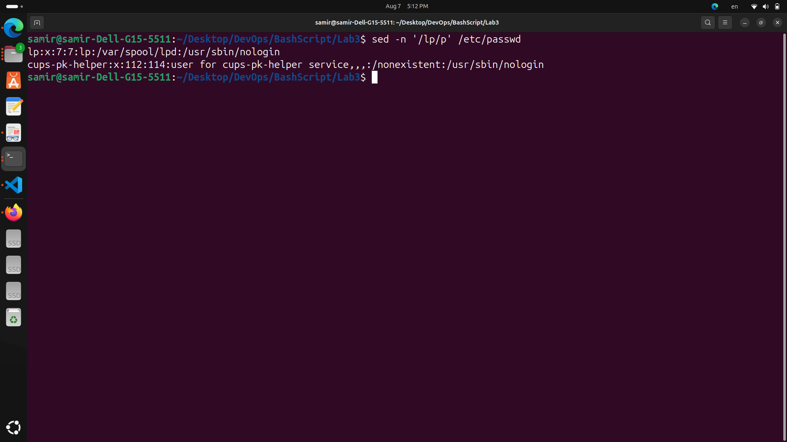

***Display/etc/passwd file except the third line***
```
sed '3d' /etc/passwd
```
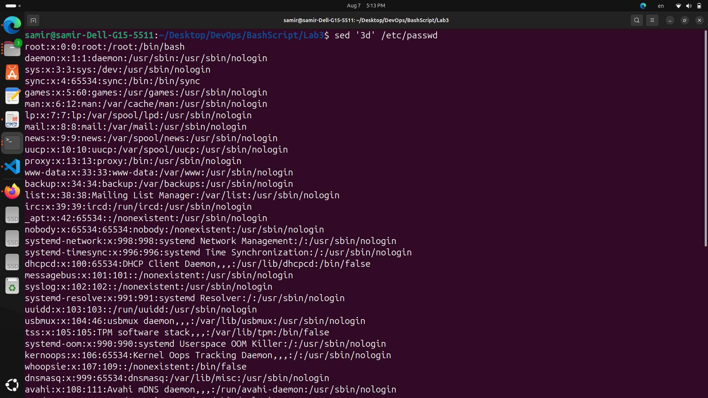

***Display/etc/passwd file except the last line***
```
sed '$d' /etc/passwd
```
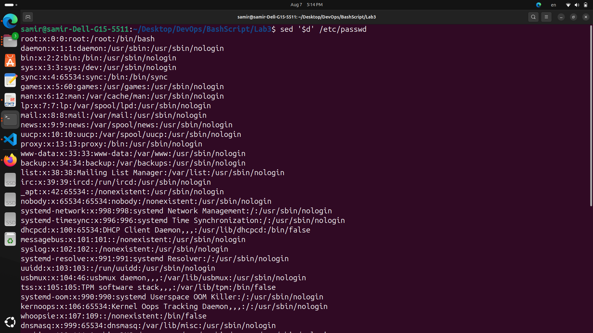

***Display/etc/passwd file except the lines that contain the word "Ip"***
```
sed '/lp/d' /etc/passwd
```
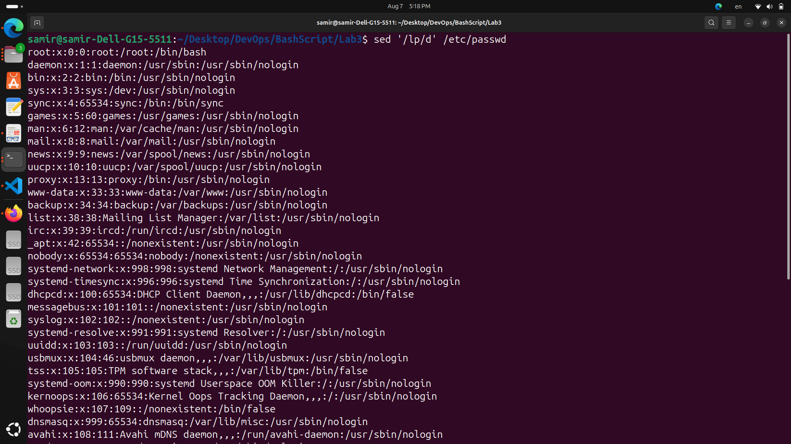

***Substitute all the words that contain "Ip" with "mylp" in /etc/passwd file***
```
sed 's/lp/mylp/g' /etc/passwd
```
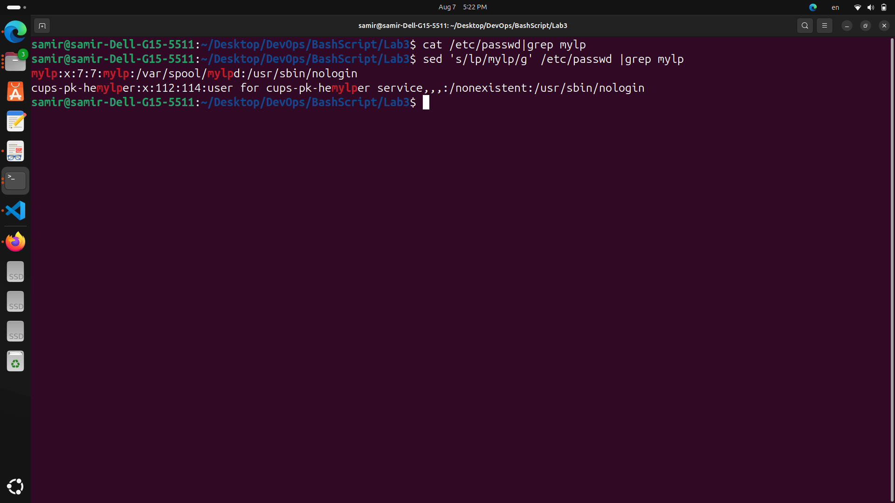

## Using awk utility

***Print full name (comment) of all users in the system***
```
awk -F: '{print $5}' /etc/passwd
```
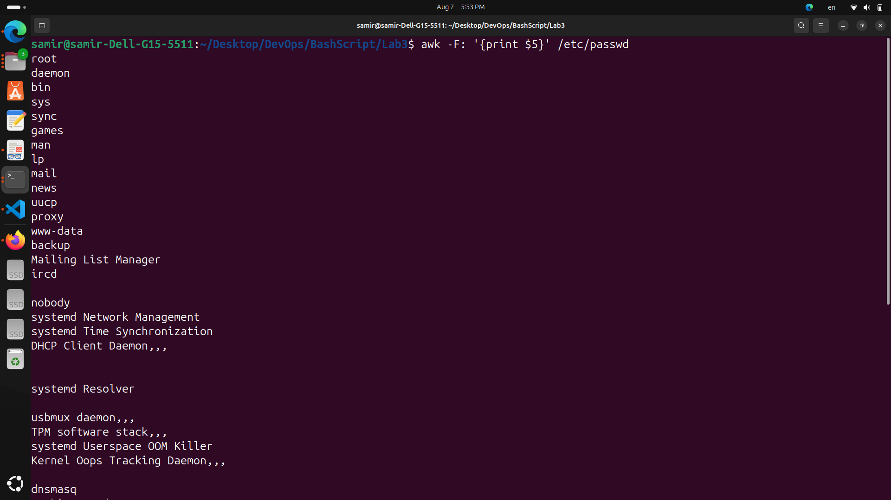


***Print login, full name (comment) and home directory of all users. (Print each line preceded by a line number)***
```
awk -F: '{print NR, $1, $5, $6}' /etc/passwd
```
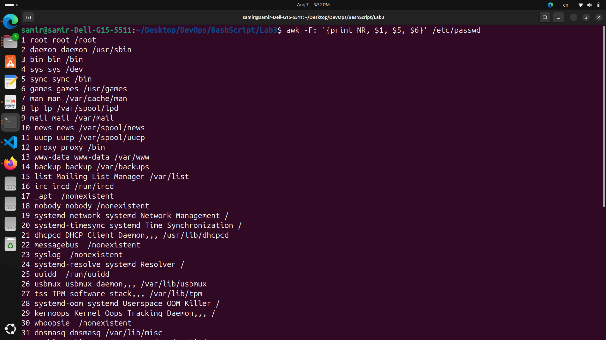

***Print login, uid and full name (comment) of those uid is greater than 500***
```
awk -F':' '$3 > 500 {print $1, $3, $5}' /etc/passwd
```
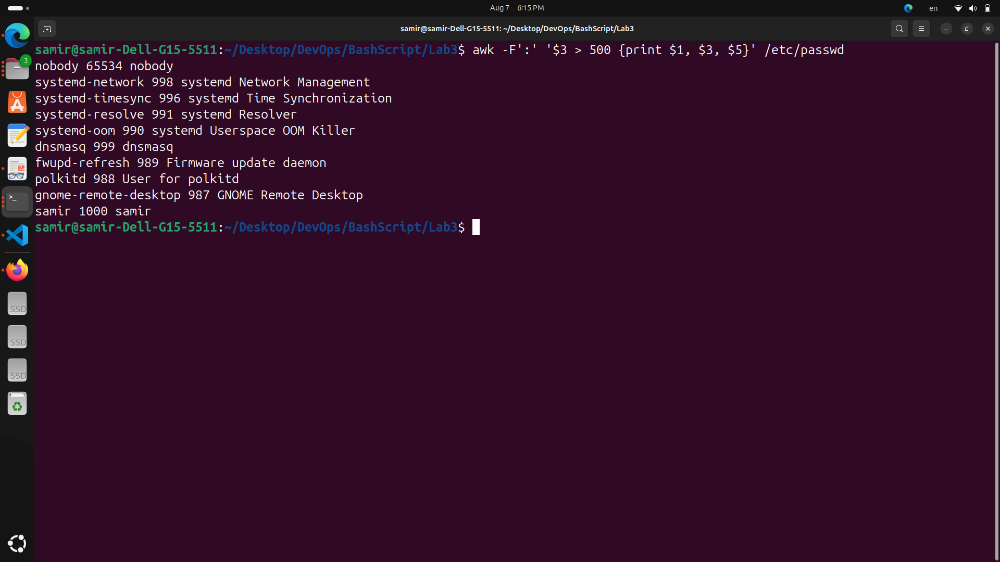

***Print login, uid and full name (comment) of those uid is exactly 500***
```
awk -F':' '$3 == 500 {print $1, $3, $5}' /etc/passwd
```
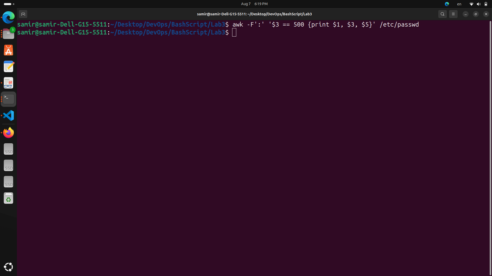

***Print line from 5 to 15 from /etc/passwd***
```
awk 'NR>=5 && NR<=15' /etc/passwd
```
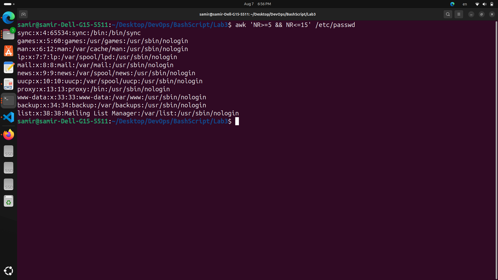

***Change lp to mylp***
```
awk '{gsub(/lp/, "mylp"); print}' ./passwd
#or
awk 'BEGIN{FS=OFS=":"} {gsub(/lp/, "mylp", $1); gsub(/lp/, "mylp", $5); gsub(/lp/, "mylp", $6)}1' ./passwd
```
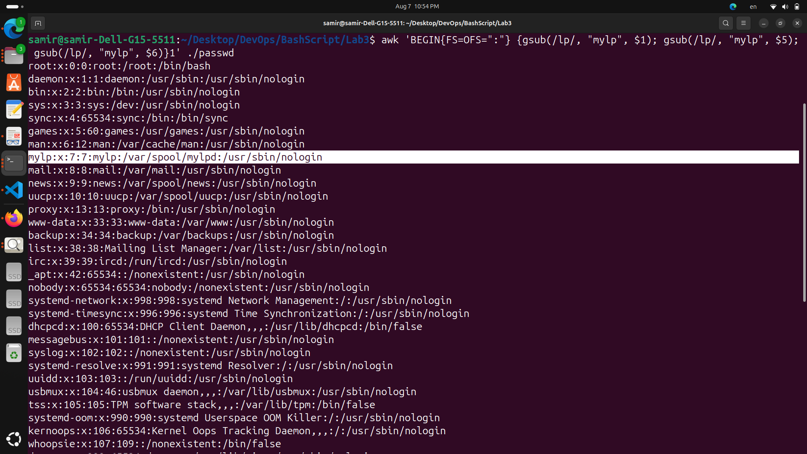

***Print all information about greatest uid***
```
#$0 is current line
#$3 is uid

awk -F':' 'max<$3 {max=$3; maxline=$0} END {print maxline}' /etc/passwd
```
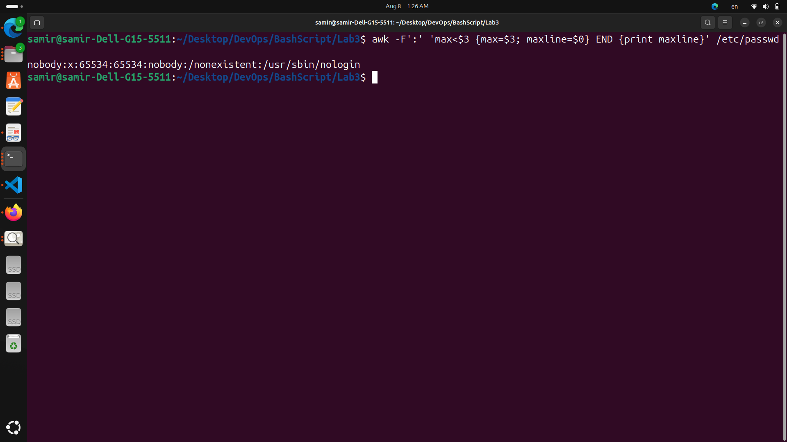

***Get the sum of all accounts id's***
```
awk -F: '{sum+=$3} END {print sum}' /etc/passwd
```
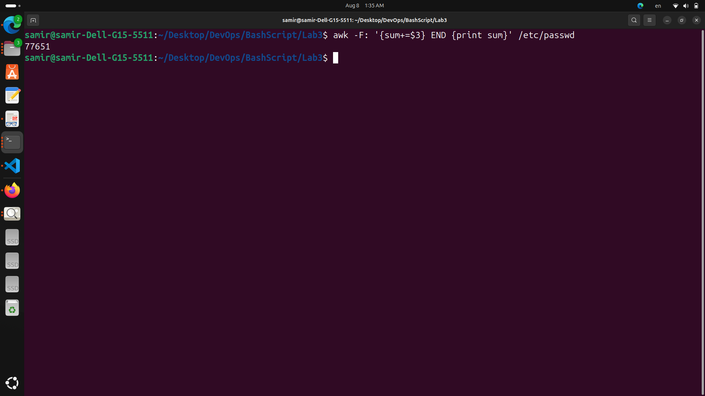

***Get the sum of accounts id's that has the same group***
```
#$4 ->group id ->$1
#$3 ->usr id -> $2
awk -F: '{print $4, $3}' /etc/passwd 
| awk '{gid[$1]+=$2} END {for (g in gid) print "Group ID:", g, "Sum of Account IDs:", gid[g]}'
```
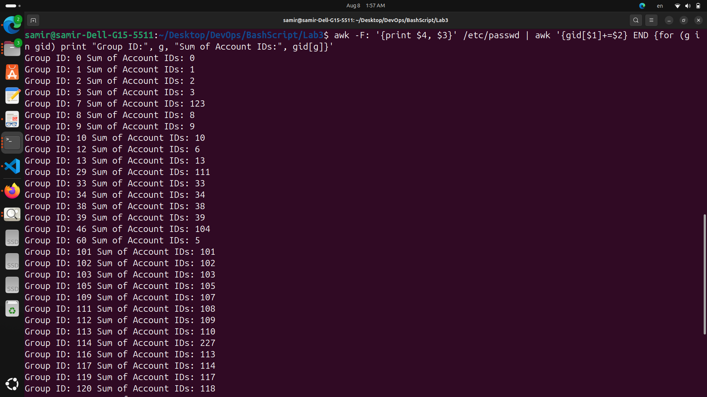


***User-Group Report***
-----------------------------------
- Group1 Name:

    - User1

    - User2

- Group2 Name:

    - User3

    - User4

```
#!/bin/bash

echo "User-Group Report"
echo "-----------------------------------"

awk -F: '
BEGIN {
  # Read the /etc/group file to get group names
  while ((getline < "/etc/group") > 0) {
    split($0, fields, ":")
    groupname[fields[3]] = fields[1]
  }
  close("/etc/group")
}
{
  # Collect users under each group
  users[$4] = users[$4] "\n" $1
}
END {
  for (gid in users) {
    print groupname[gid] " Name:" users[gid]
  }
}
' /etc/passwd
```
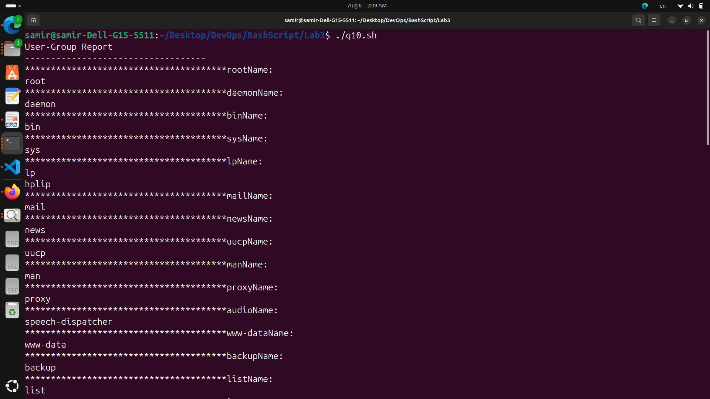
