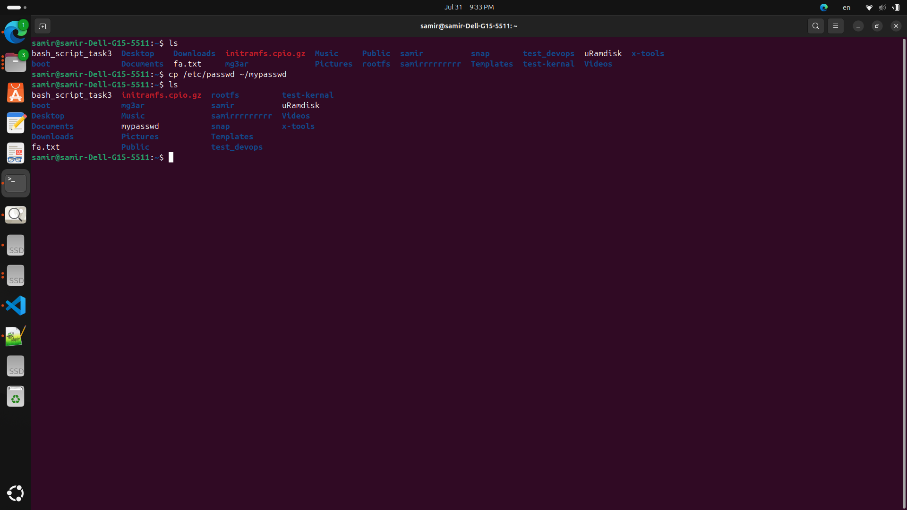

# LAB 1

***What is the difference between cat and more command?***
```
cat command: It is short for "concatenate" and is primarily used to display the content of one or more files sequentially. It is often used to quickly display the entire content of a file to the terminal.

more command: It is used to paginate through the contents of a file, displaying one screenful of text at a time. It waits for user input, typically pressing the spacebar to display the next page, making it more suitable for viewing longer files without overwhelming the terminal.

```

***What is the difference between rm and rmdir using man?***
```
rm command: It stands for "remove." It is used to delete files or directories in Unix-like operating systems. When removing directories, it can recursively delete all files and subdirectories within the specified directory.

rmdir command: It stands for "remove directory." It is specifically used to remove empty directories. If a directory contains any files or other directories, rmdir will not remove it and will give an error message. If you want to remove directories along with their contents, you'd typically use rm -r instead.

```

***Create the following hierarchy under your home directory:***
```
mkdir -p dir1/dir11/dir12 dir1/dir12 docs

touch dir1/dir11/file1 docs/mycv

```


***Remove dir11 in one-step. What did you notice? And how did you overcome that?***
```
rm -r dir1/dir11

we cannot be removed with rmdir.
```


***Then remove dir12 using rmdir -p command. State what happened to the hierarchy***

```
rmdir -p dir1/dir12/
#dir1 will be remove also
```


***The output of the command pwd was /home/user. Write the absolute and relative path for the file mycv***

```
Absolute path: /home/user/docs/mycv
Relative path: docs/mycv
```

***Copy the /etc/passwd file to your home directory making its name mypasswd***
```
cp /etc/passwd ~/mypasswd
```


***Rename this new file to be oldpasswd***
```
mv ~/mypasswd ~/oldpasswd
```


***You are in /usr/bin, list four ways to go to your home directory***
```
cd ~
cd $HOME
cd /home/samir/
cd
```


***List Linux commands in /usr/bin that start with letter w***
```
ls /usr/bin/w*
```


***Display the first 4 lines of /etc/passwd***
```
head -n 4 /etc/passwd
```


***Display the last 7 lines of /etc/passwd***
```
tail -n 7 /etc/passwd
```


***Display the man pages of passwd the command and the file sequentially in one command***
```
man passwd && man 5 passwd
```
***Display the man page of the passwd file***
```
man 5 passwd
```
***Display a list of all the commands that contain the keyword passwd in their man page***
```
apropos passwd
```
