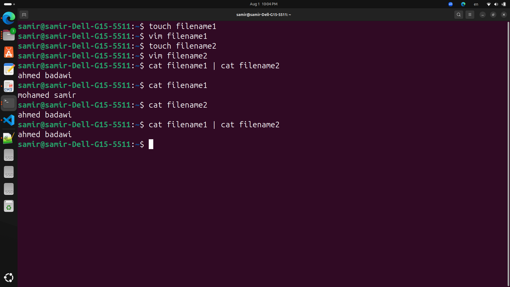

# LAB 2

Create a user account with the following attribute
- username: islam
- Fullname/comment: Islam Askar
- Password: islam
```
sudo useradd -c "islam Askar" -m islam
echo "islam:islam" | sudo chpasswd
```


***Create a user account with the following attribute***
- username: baduser
- Fullname/comment: Bad User
- Password: baduser
```
sudo useradd -c "Bad User" -m baduser
echo "baduser:baduser" | sudo chpasswd
```


***Create a supplementary (Secondary) group called pgroup with group ID of 30000***
```
sudo groupadd -g 30000 pgroup
tail -n 5 /etc/group
```


***Create a supplementary group called badgroup***
```
sudo groupadd badgroup
```


***Add islam user to the pgroup group as a supplementary group***
```
sudo usermod -aG pgroup islam
```


***Modify the password of islam's account to password***
```
echo "islam:password" | sudo chpasswd
```


***Modify islam's account so the password expires after 30 days***
```
sudo chage -M 30 islam
sudo cat /etc/shadow | grep islam
```


***Lock bad user account so he can't log in***
```
sudo usermod -L baduser
```


***Delete bad user account***
```
sudo userdel -r baduser
```


***Delete the supplementary group called badgroup***
```
sudo groupdel badgroup
```


***Create a folder called myteam in your home directory and change its permissions to read only for the owner***
```
mkdir ~/myteam
#chmod owner group other
#chmod rwxrwxrwx
sudo chmod 400 ~/myteam
```


***Log out and log in by another user and try to access (by cd command) the folder (myteam)***
```
cd /home/samir/myteam
```


***List the user commands and redirect the output to /tmp/commands.list***
```
compgen -c > /tmp/commands.list
```


***Count the number of user commands***
```
compgen -c | wc -l
```


***Get all the users names whose first character in their login is ‘g’***
```
According to this field
```


```
awk -F: '/^g/ {print $1}' /etc/passwd
```


***Get the logins name and full names (comment) of logins starts with “g”***
```
awk -F: '/^g/ {print $1,"   ",$5}' /etc/passwd
```


***Save the output of the last command sorted by their full names in a file***
```
awk -F: '/^g/ {print $1,"   ",$5}' /etc/passwd | sort -k 2 -> output_file.txt

```


Write two commands: 
- first: to search for all files on the system that named .bash_profile. 
- Second: sorts the output of ls command on / recursively, 
- Saving their output and error in 2 different files and sending them to the background.
```
find / -name .bash_profile
```


```
ls -R / 2>error_lab2.txt 1>output_lab2.txt
```


***Display the number of users who is logged now to the system***
```
who | wc -l
```


***Display lines 7 to line 10 of /etc/passwd file***
```
head -n 10 /etc/passwd | tail -n 4 
```


***What happens if you execute:***
```
cat filename1 | cat filename2
```


```
ls | rm
```


```
ls /etc/passwd | wc –l
```

