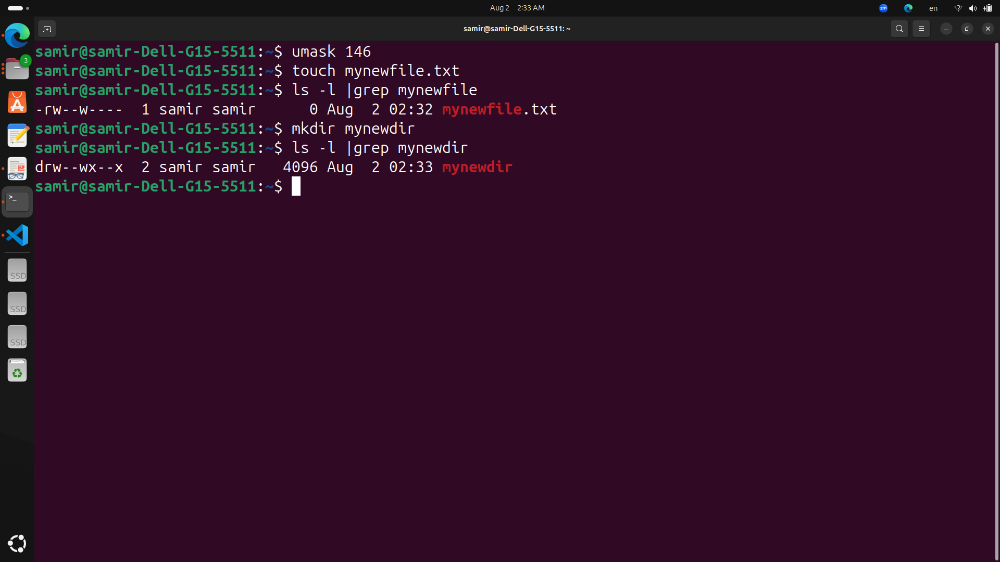
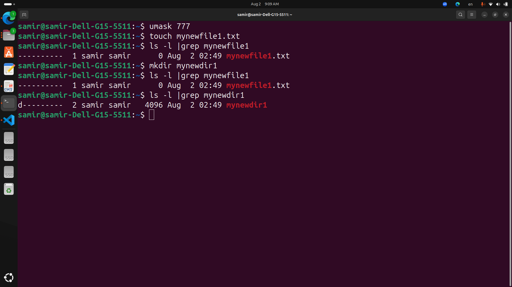
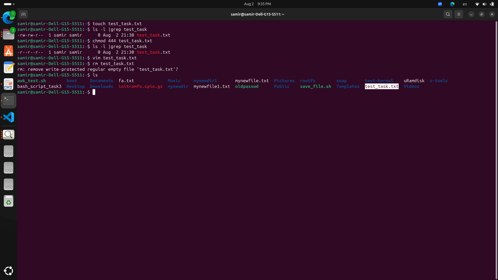
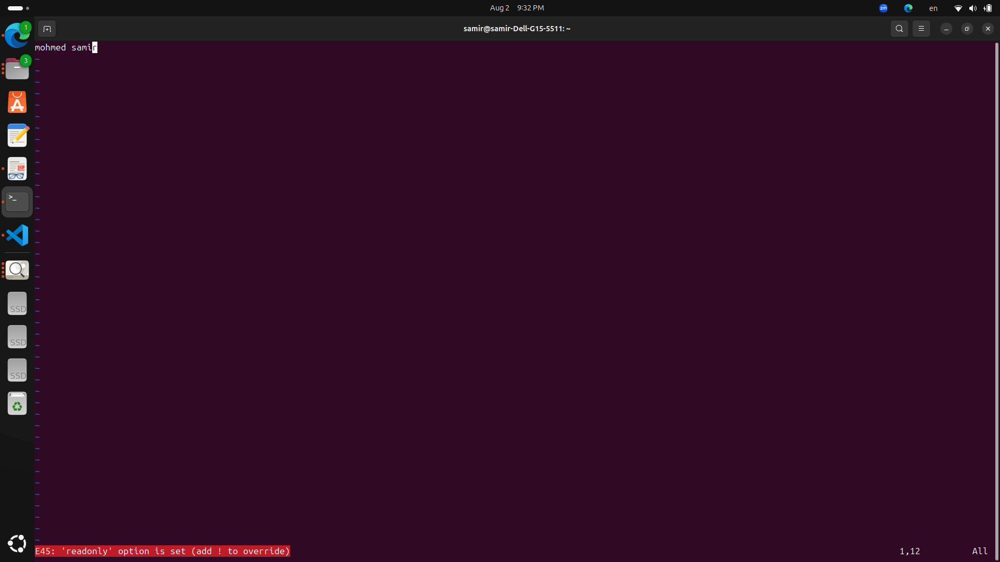
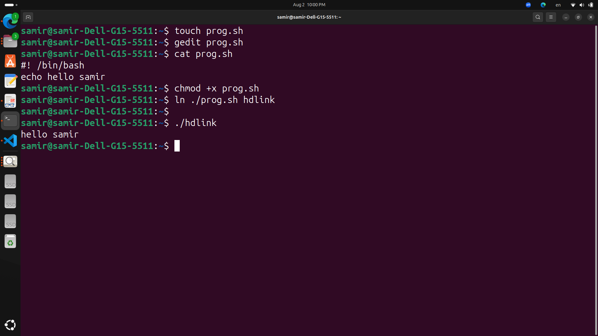
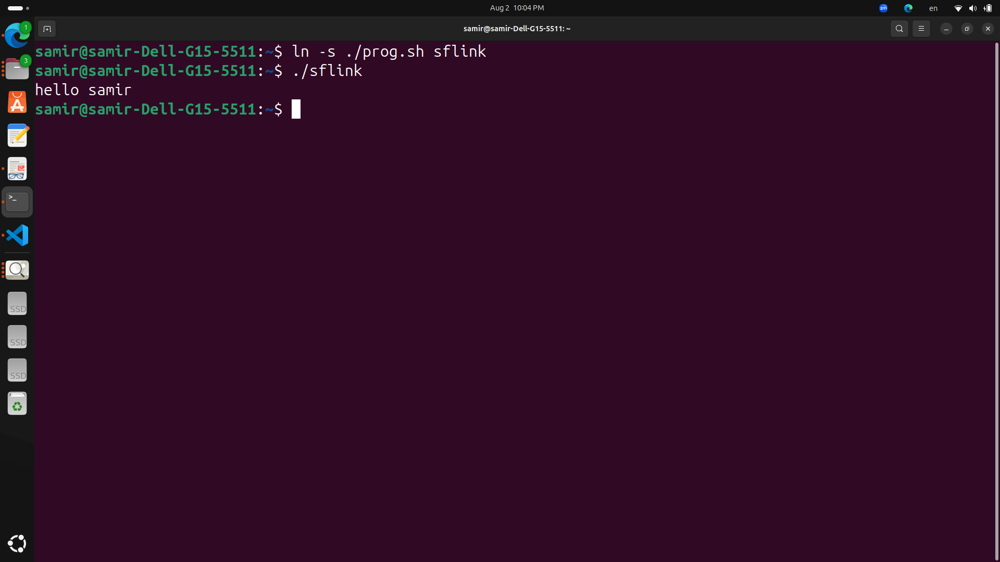

# LAB 3-1

***Change the permissions of oldpasswd file to give owner read and write***
```
chmod 631 oldpasswd

chmod u=rw,g=wx,o=x oldpasswd
```

***Change your default permissions to be as above***
```
umask 146
```
***What is the maximum permission a file can have, by default when it is just created? And what is that for directory ?***
```
with this default file has 620 mode but
with normal default 666 mode
and dir has default 631 mode but
with normal default 777 mode
```


***Change your default permissions to be no permission to everyone then create a directory and a file to verify***
```
umask 777
touch mynewfile1.txt
mkdir mynewdir1
ls -l |grep mynewfile1
ls -l |grep mynewdir1
```


***Minimum Permissions Needed***
```
- Copy a directory:

    • Source directory: Read and execute (r-x).
    • Target parent directory: Write and execute (wx).

- Copy a file:

Source file: Read (r--).
    • Target parent directory: Write and execute (wx).

- Delete a file:

    • File's parent directory: Write and execute (wx).

- Change to a directory:

    • Directory: Execute (x).

- List directory content:

    • Directory: Read (r--).

- View file content:

    • File: Read (r--).

-Modify a file content:

    • File: Write (w--).

```

***Create a file with permission 444. Try to edit in it and to remove it? Note what happened.***
```
touch test_task.txt
chmod 444 test_task.txt
rm test_task.txt
#conclusion with this mode file is readonly and we can't remove 
#because no Execute or Write Permissions
```



***What is the difference between the “x” permission for a file and for a directory?***
```
- File:

    • The x permission allows the file to be executed (e.g., running a script or binary).

- Directory:

    • The x permission allows you to enter the directory and access files within it.
```

***Create a hard link and soft link for the origin file, Describe two differences***
```
- Create a hard link:
    • ln ./prog.sh hdlink
```


```
- Create a soft link:
    • ln -s ./prog.sh sflink
```


***Differences between hard and soft links***
```
- Hard Link:
    • Points directly to the file’s inode (the actual data on disk).
    • Cannot span different filesystems.
    • When the original file is deleted, the hard link still works.
- Soft Link (Symbolic Link):
    • Points to the file’s path.
    • Can span different filesystems.
    • If the original file is deleted, the soft link becomes broken and does not work.
```
